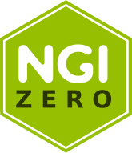

<div align="center">
  <h1>mCaptcha PoW CLI</h1>
  <p>
    <strong>mCaptcha - PoW based DoS protection</strong>
  </p>

[](https://mcaptcha.github.io/mCaptcha/mcaptcha_cli/index.html)
/badge.svg>)
[](https://deps.rs/repo/github/mCaptcha/cli)
<br />
[](https://codecov.io/gh/mCaptcha/cli)

</div>

## Usage

```bash
mCaptcha PoW CLI 0.1.0
Aravinth Manivannan <realaravinth@batsense.net>
Generates PoW for mCaptcha

USAGE:
    mcaptcha-cli [OPTIONS]

FLAGS:
    -h, --help       Prints help information
    -V, --version    Prints version information

OPTIONS:
    -d, --difficulty <INTEGER>    Difficulty factor
    -p, --phrase <STRING>         Phrase over which PoW should be computed
    -s, --salt <STRING>           Salt with which PoW should be computed
```

## Funding

### NLnet

<div align="center">
	
</div>

<br />

2023 development is funded through the [NGI0 Entrust
Fund](https://nlnet.nl/entrust), via [NLnet](https://nlnet.nl/). Please
see [here](https://nlnet.nl/project/mCaptcha/) for more details.
